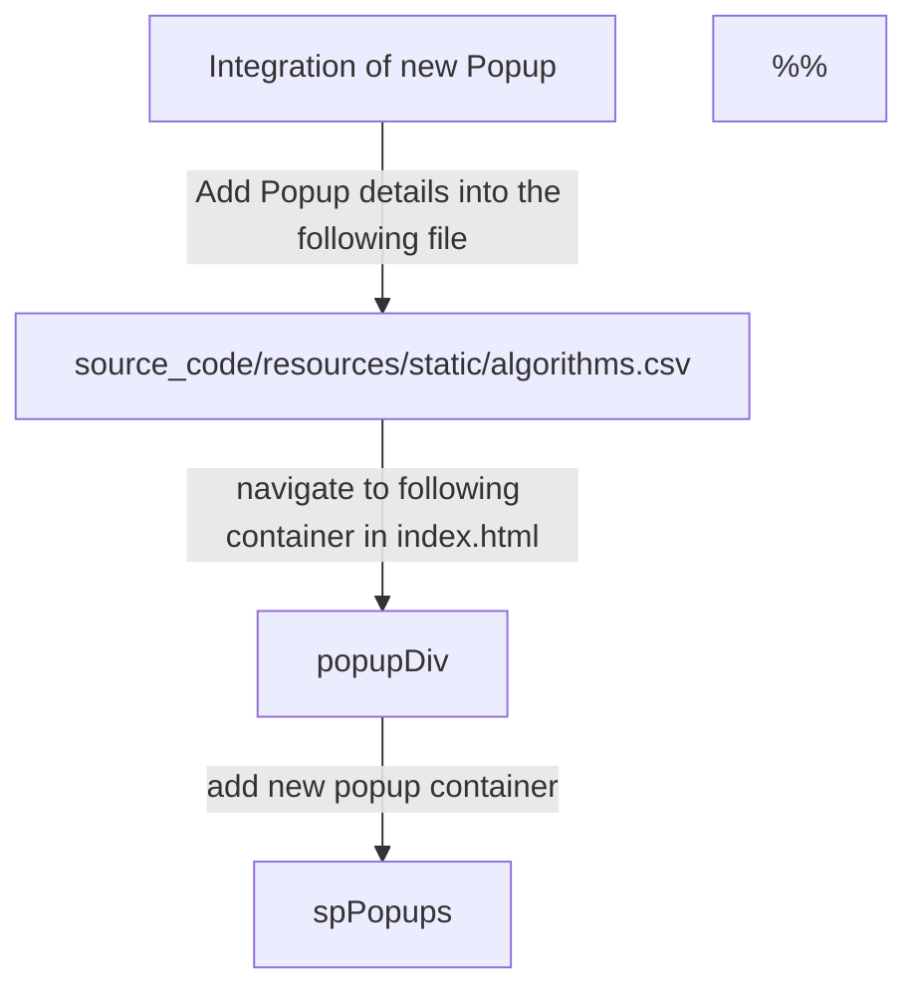

### &nbsp;The following script is an basic structure of an html file.

```
<!DOCTYPE html>
<html lang="en">
<head>
    <meta charset="UTF-8">
    <meta name="viewport" content="width=device-width, initial-scale=1.0">
    <title>Document</title>
    <!-- Additional meta tags, CSS links, and scripts can be added here -->
</head>
<body>
    <!-- Content of the HTML document goes here -->
    <header>
        <!-- Header content such as navigation links, logos, etc. -->
    </header>

    <main>
        <!-- Main content of the page -->
    </main>

    <footer>
        <!-- Footer content such as copyright information, contact details, etc. -->
    </footer>
    <!-- Additional scripts or JavaScript can be added before closing the body tag -->
</body>
</html>
```

<SwmSnippet path="/source_code/frontend.html" line="4">

---

### This code is responsible for setting up the basic structure and settings of a web page.&nbsp;

- It includes the definition of the character set,&nbsp;
- viewport settings for responsive design, the title of the page,&nbsp;
- and the shortcut icon displayed in the browser tab.

```html
<head>
	<meta charset="UTF-8" />
	<meta name="viewport" content="width=device-width,initial-scale=1.0">
	<title>Statcraft</title>
	<link rel="shortcut icon" href="images/statcraft_icon.ico" type="image/x-icon">
```

---

</SwmSnippet>

&nbsp;

<SwmSnippet path="/source_code/frontend.html" line="10">

---

### External CSS file Imports.

- All the external css files are available inside /path_to_folder in a simple hierarchical manner,
- These css resources are imported as and when needed from <SwmPath>[source_code/index.html](/source_code/index.html)</SwmPath> and corresponding external html files,
- It includes three separate <SwmToken path="/source_code/frontend.html" pos="8:2:2" line-data="	&lt;link rel=&quot;shortcut icon&quot; href=&quot;images/statcraft_icon.ico&quot; type=&quot;image/x-icon&quot;&gt;">`link`</SwmToken> tags, each linking to a different CSS file.
- These CSS files are used to style various elements of the webpage, such as the global styles, index page styles, and popup styles.

```
	<!-- external css imports -->
	<link rel="stylesheet" type="text/css" th:href="@{css/global/global.css}" />
	<link rel="stylesheet" type="text/css" th:href="@{css/global/index.css}" />
	<link rel="stylesheet" type="text/css" th:href="@{css/global/popup.css}" />
```

---

</SwmSnippet>

<SwmSnippet path="/source_code/frontend.html" line="50">

---

### The following External resources are included into the project.

- <SwmToken path="/source_code/frontend.html" pos="51:34:38" line-data="	&lt;link rel=&quot;stylesheet&quot; type=&quot;text/css&quot; href=&quot;/webjars/bootstrap/5.3.2/css/bootstrap.min.css&quot; /&gt;">`bootstrap.min.css`</SwmToken> stylesheet from the Bootstrap library.
- <SwmToken path="/source_code/frontend.html" pos="52:20:26" line-data="	&lt;script src=&quot;/webjars/bootstrap/5.3.2/js/bootstrap.bundle.min.js&quot;&gt;&lt;/script&gt;">`bootstrap.bundle.min.js`</SwmToken> script from the Bootstrap library.
- <SwmToken path="/source_code/frontend.html" pos="53:18:22" line-data="	&lt;script src=&quot;/webjars/jquery/3.7.1/jquery.min.js&quot;&gt;&lt;/script&gt;">`jquery.min.js`</SwmToken> script from the <SwmToken path="/source_code/frontend.html" pos="53:10:10" line-data="	&lt;script src=&quot;/webjars/jquery/3.7.1/jquery.min.js&quot;&gt;&lt;/script&gt;">`jquery`</SwmToken> library.

These resources are used to enhance the styling and interactive functionality of the web page.

These resources packages are downloaded and placed inside the following path.

/path to the resources

```
	<!-- Include external resources below -->
	<link rel="stylesheet" type="text/css" href="/webjars/bootstrap/5.3.2/css/bootstrap.min.css" />
	<script src="/webjars/bootstrap/5.3.2/js/bootstrap.bundle.min.js"></script>
	<script src="/webjars/jquery/3.7.1/jquery.min.js"></script>
	<!-- End of external resources -->
```

---

</SwmSnippet>

<SwmSnippet path="/source_code/frontend.html" line="59">

---

### **Body Element Overview**

- **Objective:**

  - The `<body>` element encompasses all content within the HTML document.

- **Inline** <SwmToken path="/source_code/frontend.html" pos="59:3:3" line-data="&lt;body style=&quot;margin: 8px; overflow: hidden;&quot;&gt;">`style`</SwmToken>**:**

  - <SwmToken path="/source_code/frontend.html" pos="59:12:12" line-data="&lt;body style=&quot;margin: 8px; overflow: hidden;&quot;&gt;">`overflow`</SwmToken> property set to <SwmToken path="/source_code/frontend.html" pos="59:15:15" line-data="&lt;body style=&quot;margin: 8px; overflow: hidden;&quot;&gt;">`hidden`</SwmToken>.

    - Purpose: Designed for a One-Page Website layout.

    - Prevents scrolling beyond the viewport boundaries, maintaining a single-page experience.

```html
<body style="margin: 8px; overflow: hidden;">
	<!-- Content of the HTML document goes here -->
```

---

</SwmSnippet>

<SwmSnippet path="/source_code/frontend.html" line="67">

---

### <SwmToken path="/source_code/frontend.html" pos="67:7:7" line-data="	&lt;div class=&quot;headerDiv&quot; style=&quot;height: 113px;&quot; th:insert=&quot;~{layouts/header.html}&quot;&gt;&lt;/div&gt;">`headerDiv`</SwmToken> is a wrapper container for various elements that goes into header section of the web page.

```html
	<div class="headerDiv" style="height: 113px;" th:insert="~{layouts/header.html}"></div>
```

---

</SwmSnippet>

<SwmSnippet path="/source_code/frontend.html" line="68">

---

### <SwmToken path="/source_code/frontend.html" pos="68:7:7" line-data="	&lt;div class=&quot;bodyDiv&quot;&gt;">`bodyDiv`</SwmToken> is a wrapper container for following members

- <SwmToken path="/source_code/frontend.html" pos="70:14:14" line-data="		&lt;div tabindex=&quot;-1&quot; class=&quot;sidenavi statcraftscrollbar&quot; id=&quot;mySidenavi&quot; style=&quot;width: 0px;&quot;&gt;&lt;/div&gt;">`sidenavi`</SwmToken> : Navigation Bar
- <SwmToken path="/source_code/frontend.html" pos="71:7:7" line-data="		&lt;div class=&quot;popupDiv statcraftscrollbar&quot; id=&quot;popupDivId&quot; value=&quot;&quot;&gt;">`popupDiv`</SwmToken> : Application Popup containers
- <SwmToken path="/source_code/frontend.html" pos="301:7:7" line-data="		&lt;div id=&quot;viewmenu&quot; th:insert=&quot;~{layouts/viewMenu.html}&quot;&gt;&lt;/div&gt;">`viewmenu`</SwmToken>&nbsp;
- <SwmToken path="/source_code/frontend.html" pos="303:7:7" line-data="		&lt;div id=&quot;outputprintpage&quot; th:insert=&quot;~{layouts/outputprintdivs.html}&quot;&gt;&lt;/div&gt;">`outputprintpage`</SwmToken>
- <SwmToken path="/source_code/frontend.html" pos="305:7:7" line-data="		&lt;div class=&quot;appPagesDiv&quot; style=&quot;height: 100%; width: 100%;&quot;&gt;">`appPagesDiv`</SwmToken>

```html
	<div class="bodyDiv">
```

---

</SwmSnippet>

<SwmSnippet path="/source_code/frontend.html" line="70">

---

### <SwmToken path="/source_code/frontend.html" pos="70:14:14" line-data="		&lt;div tabindex=&quot;-1&quot; class=&quot;sidenavi statcraftscrollbar&quot; id=&quot;mySidenavi&quot; style=&quot;width: 0px;&quot;&gt;&lt;/div&gt;">`sidenavi`</SwmToken> is a wrapper container for following members

- Various popups will get embeded as a list of links dynamically into this container while loading the web page.
- If new popup is to be added, it must be added into <SwmPath>[source_code/resources/static/algorithms.csv](/source_code/resources/static/algorithms.csv)</SwmPath> file&nbsp;

```
		<div tabindex="-1" class="sidenavi statcraftscrollbar" id="mySidenavi" style="width: 0px;"></div>
```

---

</SwmSnippet>

<SwmSnippet path="/source_code/frontend.html" line="71">

---

### Application popups

- <SwmToken path="/source_code/frontend.html" pos="71:7:7" line-data="		&lt;div class=&quot;popupDiv statcraftscrollbar&quot; id=&quot;popupDivId&quot; value=&quot;&quot;&gt;">`popupDiv`</SwmToken> is a wrapper container for various popup containers
- <SwmToken path="/source_code/frontend.html" pos="73:7:7" line-data="			&lt;div class=&quot;spPopups userprofilepopupclass&quot; th:insert=&quot;~{popups/userprofile.html}&quot;&gt;&lt;/div&gt;">`spPopups`</SwmToken> is a common wrapper container used for integrating various popup pages
- If a new popup is to be integrated new wrapper container <SwmToken path="/source_code/frontend.html" pos="73:7:7" line-data="			&lt;div class=&quot;spPopups userprofilepopupclass&quot; th:insert=&quot;~{popups/userprofile.html}&quot;&gt;&lt;/div&gt;">`spPopups`</SwmToken>is to be added inside <SwmToken path="/source_code/frontend.html" pos="71:7:7" line-data="		&lt;div class=&quot;popupDiv statcraftscrollbar&quot; id=&quot;popupDivId&quot; value=&quot;&quot;&gt;">`popupDiv`</SwmToken> with proper id's and source link in <SwmToken path="/source_code/frontend.html" pos="73:12:14" line-data="			&lt;div class=&quot;spPopups userprofilepopupclass&quot; th:insert=&quot;~{popups/userprofile.html}&quot;&gt;&lt;/div&gt;">`th:insert`</SwmToken>&nbsp;

```html
		<div class="popupDiv statcraftscrollbar" id="popupDivId" value="">
			<!-- application popups -->
			<div class="spPopups userprofilepopupclass" th:insert="~{popups/userprofile.html}"></div>
			<div class="spPopups valuevaluelabelpopupclass" th:insert="~{popups/valuevaluelabel.html}"></div>
			<div class="spPopups normalizepopupclass" th:insert="~{popups/normalize/normalize.html}"></div>
```

---

</SwmSnippet>



&nbsp;

<SwmMeta version="3.0.0" repo-id="Z2l0aHViJTNBJTNBZG9jdW1lbnRhdGlvbiUzQSUzQXZpbmF5YWtiYW5hdmk=" repo-name="documentation"><sup>Powered by [Swimm](https://app.swimm.io/)</sup></SwmMeta>
